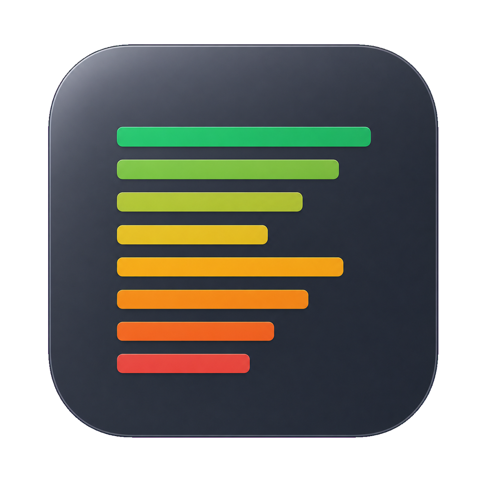
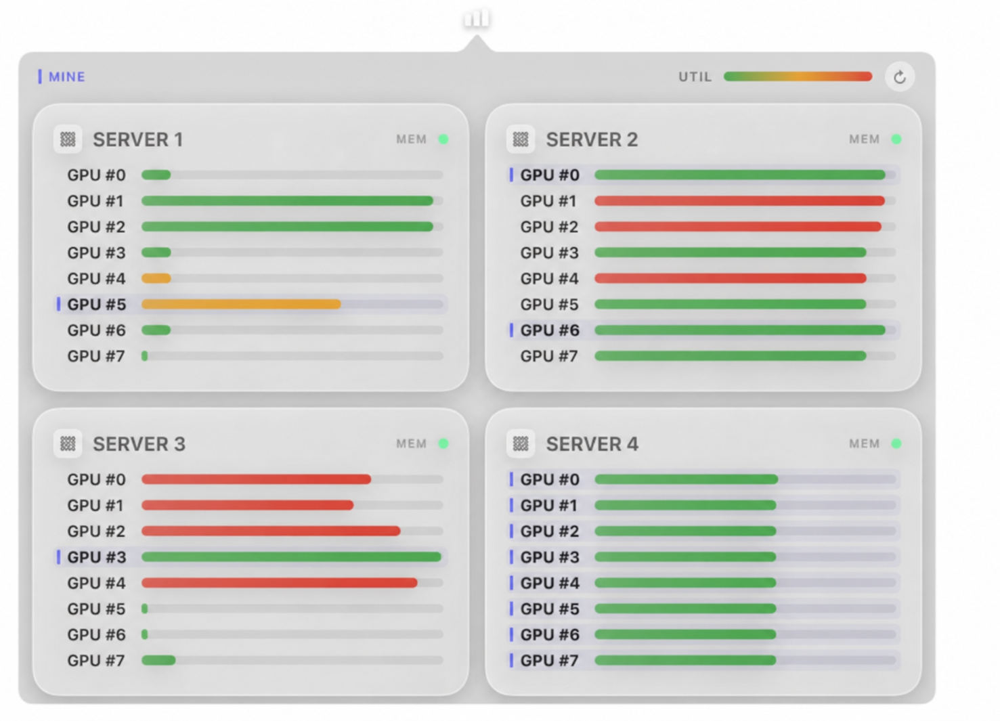

# GPU Pulse

[English](README.md) | [简体中文](README.zh-CN.md)

<p align="center">
  
</p>

GPU Pulse is a compact native macOS menu-bar app for checking GPU memory and
utilization across multiple servers. It talks directly to the servers over your
existing SSH configuration—there is no hosted backend and no monitoring data is
uploaded elsewhere.

## Visuals

### App Icon

<p align="center">
  
</p>

The stacked horizontal bars represent a bank of GPUs. Their green-to-red
palette matches the dashboard’s utilization colors, while the dark rounded
background keeps the icon readable in the Dock, Finder, and macOS app grid.

### Dashboard



The screenshot uses generic `SERVER 1–4` labels. Real SSH aliases stay in the
local `servers.json` file and are never embedded in repository images.

## What It Shows

- Four servers are shown in a compact 2×2 grid.
- Each row represents one GPU. Bar length is memory usage; green, yellow, and
  red represent GPU utilization.
- `MINE` highlights GPUs running processes owned by your SSH login user.
- Left-click the menu-bar icon to open the monitor.
- Right-click it to change the refresh interval, toggle Launch at Login, or
  quit GPU Pulse.
- Polling runs only while the panel is open. Closing the panel pauses SSH
  queries.

## Install

1. Download `GPU-Pulse-macOS.zip` from the
   [latest release](https://github.com/junle-chen/monitor/releases/latest).
2. Unzip it and move `GPU Pulse.app` into `/Applications`.
3. Control-click the app and choose **Open** on the first launch if macOS asks
   you to confirm the locally signed build.
4. Create the local server configuration:

   ```zsh
   mkdir -p "$HOME/Library/Application Support/GPU Pulse"
   cp app/servers.example.json \
     "$HOME/Library/Application Support/GPU Pulse/servers.json"
   ```

5. Edit `servers.json` locally with your own display names and SSH aliases, then
   verify each alias works without an interactive password prompt:

   ```zsh
   ssh gpu-server-1 nvidia-smi
   ```

Do not commit your real `servers.json`. GPU Pulse requires macOS 13 or newer.
Remote hosts must provide `nvidia-smi` and key-based SSH access.

## Usage

- **Open/close:** left-click the menu-bar chart icon.
- **Refresh now:** click the circular arrow in the upper-right corner.
- **Settings:** right-click the menu-bar icon.
- **Refresh frequency:** choose 5, 10, 30, or 60 seconds. The default is 10
  seconds.
- **Launch at login:** enable it from the right-click menu. macOS may ask you to
  approve it in **System Settings → General → Login Items**.
- **Quit:** choose **Quit GPU Pulse** from the right-click menu.

SSH connections are multiplexed for up to 60 seconds to avoid repeating jump
host and authentication handshakes. A reconnect may still occur after that
idle window expires.

## Build from Source

```zsh
cd app
swift build -c release
```

Runtime server settings are read from
`~/Library/Application Support/GPU Pulse/servers.json`. The repository includes
only [`app/servers.example.json`](app/servers.example.json) with placeholder
aliases.

## Repository Layout

| Path | Description |
| --- | --- |
| [`app/`](app/) | Current native SwiftUI macOS application |
| [`web/`](web/) | Previous Streamlit web version |
| [`assets/`](assets/) | App icon and privacy-safe README screenshots |

## Previous Web Version

The original Streamlit monitor remains available in [`web/`](web/):

```zsh
cd web
pip install pandas streamlit
streamlit run monitor.py
```

It is retained for reference and is no longer the primary version.
